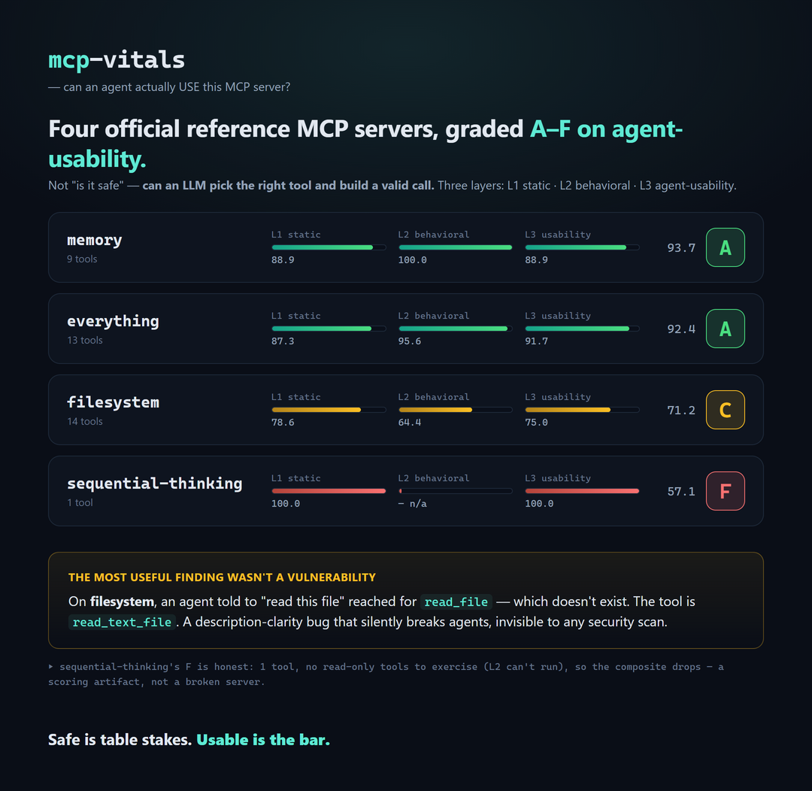

# mcp-vitals

**Reliability grades for MCP servers — run behavioral + agent-usability evals against *your*
server, in CI. Open source.**

[](https://github.com/enached134-ctrl/mcp-vitals/actions/workflows/ci.yml)
[](LICENSE)
[](https://www.python.org/)



Security scanners tell you whether an MCP server is *safe*. Hosted leaderboards grade its
*definitions* from the outside. **Neither tells you whether the tools actually work — or
whether an AI agent can figure out how to use them.** That behavioral, agent-usability layer
is what `mcp-vitals` measures, as a CLI you point at your own server and wire into CI.

## Where it fits (honest landscape, July 2026)

| Tool | What it checks | Run it yourself? | Behavioral? | Agent-usability? |
|---|---|---|---|---|
| mcp-scan / mcp-scanner / ScanMCP | **security** (injection, poisoning) | ✅ | — | — |
| ToolBench (Arcade), MCP directories | **static** definition quality, protocol, security | ❌ hosted index | — | — |
| **mcp-vitals** | **does it work + can agents use it** | ✅ **CLI + CI** | ✅ | ✅ |

Complementary, not competing: mcp-vitals *runs* `mcp-scan` as its security sub-check and can
ingest ToolBench-style static findings. It adds the half nobody runs on your server: **behavior
and agent-usability.**

## The grade (five layers → one A–F score)

| Layer | Weight | What it measures |
|---|---|---|
| **L1 · Static** | 15 | schema quality: description completeness, param docs, naming clarity, spec compliance (deterministic linter) |
| **L2 · Behavioral** | 30 | auto-generated test suite run in a sandbox: success rate, graceful errors, p50/p95 latency, output-schema conformance |
| **L3 · Agent-usability** | 25 | *the layer nobody measures* — LLM-as-judge task battery: can a model pick the right tool and construct a valid call? tool-selection + argument accuracy |
| **L4 · Adversarial** | 15 | injection-bait, tool-description poisoning heuristics, over-permission flags (+ runs `mcp-scan`) |
| **L5 · Ops** | 15 | auth, TLS, rate-limit/timeout handling, error taxonomy |

Outputs: `score.json` · a shareable `report.html` · a README badge · CI mode that exits
non-zero when the grade regresses against a baseline.

## Status — building in public

- [x] **M1**: connector (enumerate tools/resources/prompts) + L1 static linter + HTML report — grades a real server end-to-end
- [x] **M2**: L2 behavioral suite — auto-generates valid/invalid cases from each schema, runs them, measures success rate, graceful-error handling, and p50/p95 latency. Read-only by default (safe on third-party servers)
- [x] **M3**: L3 agent-usability — *the layer nobody else measures*. An LLM is given the full tool list and a realistic task per tool and must pick the right one and construct valid arguments. Reports tool-selection accuracy, argument validity, and which tools get confused. Never calls the server (safe on any target). Needs an LLM key.
- [x] **M4**: reusable GitHub Action (`uses: enached134-ctrl/mcp-vitals@v1`) + shields.io badge output + a launch run grading official public MCP servers ([`launch/STATE-OF-MCP.md`](launch/STATE-OF-MCP.md))
- [x] **L4 + L5**: adversarial (tool-poisoning & over-permission heuristics) and ops (transport security, typing discipline, error handling). Both offline — they run by default with L1, no server calls. **All five layers now live.**

## Quickstart

```bash
pip install -e .

# L1 static grade (no calls to the server):
mcpvitals grade "python examples/sample_server.py"

# + L2 behavioral (calls read-only tools, safe by default):
mcpvitals grade "python examples/sample_server.py" --behavioral

# any stdio command or http(s):// URL works; add --min-grade B to gate CI.
# → writes report.html + score.json
```

## Use it in your CI

Gate every push on your MCP server's reliability grade:

```yaml
# .github/workflows/mcp-vitals.yml
jobs:
  reliability:
    runs-on: ubuntu-latest
    steps:
      - uses: actions/checkout@v4
      - uses: enached134-ctrl/mcp-vitals@v1
        with:
          target: "python -m my_server"   # stdio command or http(s):// URL
          behavioral: "true"
          min-grade: "B"                   # fail the build below a B
```

`mcpvitals grade ... --badge badge.json` writes a [shields.io endpoint](https://shields.io/endpoint)
payload, so you can show a live grade badge on your own README.

## License

MIT
